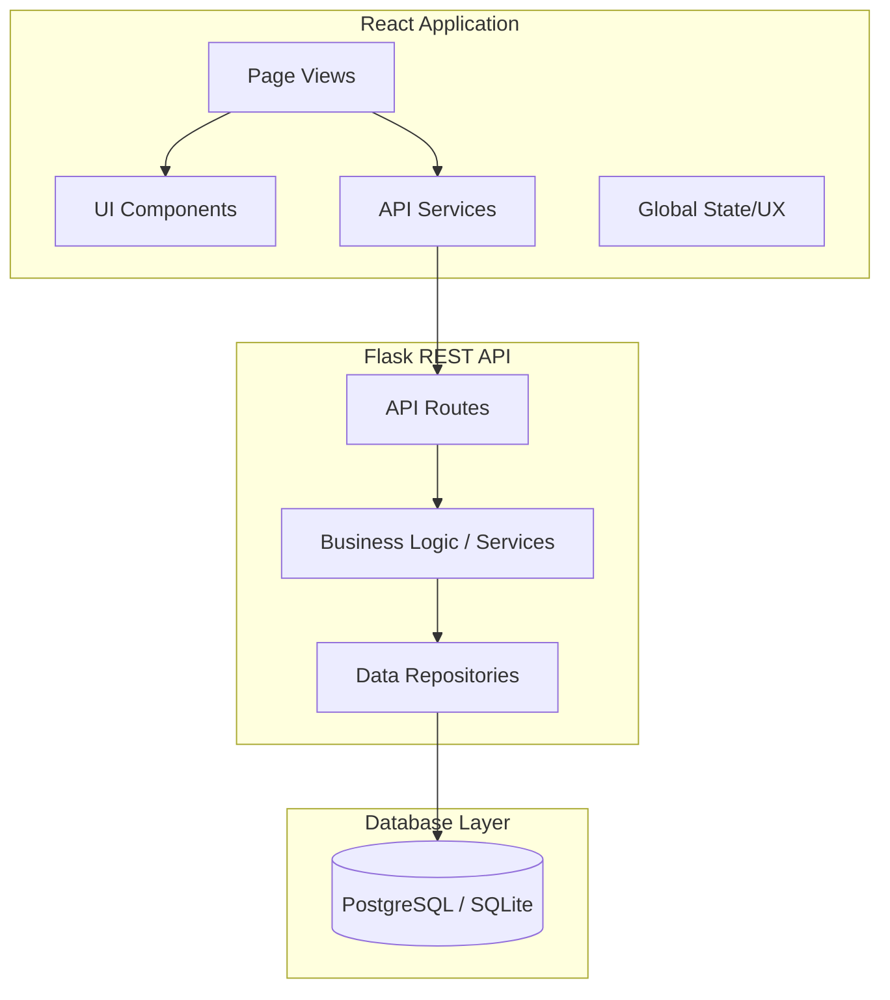
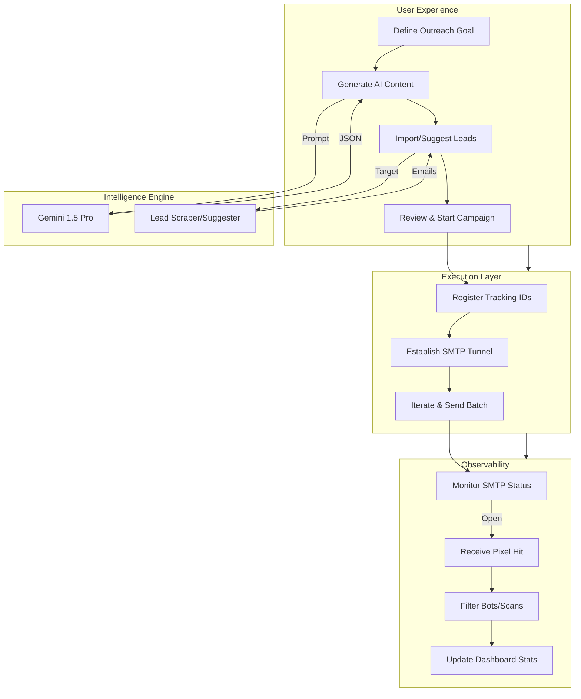

# MailFlow AI - Frontend

MailFlow AI is a React-based outreach platform designed for managing and tracking cold email workflows. The frontend interacts with a Flask-based REST API to support single-email sending, bulk campaign orchestration, and real-time open tracking.

## 🚀 Core Features

- **Single Email Outreach**: Generate and send individual emails with integrated tracking.
- **Campaign Management**: Orchestrate bulk email sequences with CSV recipient import.
- **Status Visualization**: Real-time monitoring of delivery and engagement status (SENT, OPENED, FAILED).
- **AI-Driven Research**: Integrated Gemini AI for generating personalized email templates and lead suggestions.
- **API-Driven Architecture**: Clean separation between UI components and backend communication logic.

## 📊 System Architecture

### High-Level Design


### End-to-End Workflow


## 🏗 Architecture

- **Component Layer**: Modular UI components (`src/components`) for buttons, cards, and inputs.
- **Business Layer**: Page-level components (`src/pages`) handle routing-specific data and layout.
- **Service Layer**: All API communication is isolated in `src/services/api.ts` to ensure consistency.
- **Global State**: Minimal use of React Context API, limited to system-wide UX triggers like toasts, confirmations, and loading overlays.

## 🛠 Tech Stack

- **Framework**: React 18+ (Vite)
- **Language**: TypeScript
- **Styling**: Vanilla CSS (Custom Utility-First System)
- **Routing**: React Router DOM v6
- **API Client**: Fetch API

## 📁 Project Structure

- `src/components/`: Reusable UI primitives.
- `src/context/`: Global UX providers (Toast, Confirm, Loading).
- `src/pages/`: Main views (Home, Campaigns, Dashboard, CreateCampaign).
- `src/services/`: API client and type definitions.
- `src/utils/`: Helper functions for parsing and transformations.

## 🏁 Setup Instructions

1.  **Install Dependencies**:
    ```bash
    npm install
    ```

2.  **Configure Environment**:
    Create a `.env` file in the `frontend` directory:
    ```env
    VITE_API_BASE_URL=http://localhost:5000
    ```

3.  **Run Development Server**:
    ```bash
    npm run dev
    ```

## 🧠 Design Decisions

- **Minimalist UI**: Focused on system behavior and data visibility rather than aesthetic complexity.
- **Zero Heavy UI Libraries**: Built with vanilla CSS to maintain low overhead and full control over styling.
- **Scannable Components**: Prioritized small, reusable functional components over monolithic structures.
- **Performance First**: Minimal global state to prevent unnecessary re-renders.

## ⚠️ Limitations

- **Authentication**: No built-in user authentication or session management.
- **Styling**: Minimalist design; focus is on functional verification over visual polish.
- **Backend Dependency**: Relies entirely on the backend for data validation and email execution.

## 🔮 Future Improvements

- **Real-time Updates**: Implement WebSockets for instant delivery and open notifications.
- **Advanced Analytics**: Richer visualizations for campaign conversion rates and engagement metrics.
- **Campaign Controls**: Enhanced management for pausing, resuming, and scheduling bulk sequences.

---
*Technical documentation for the MailFlow AI outreach engine.*
